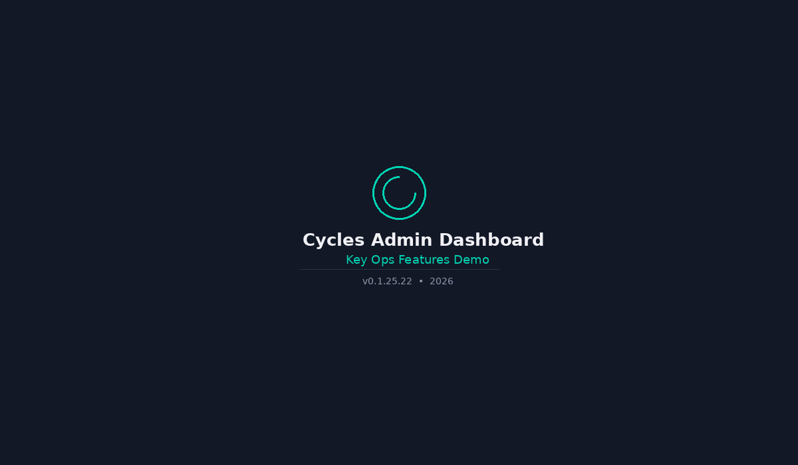

[](https://github.com/runcycles/cycles-dashboard/actions)
[](LICENSE)
[](https://github.com/runcycles/cycles-protocol/blob/main/cycles-governance-admin-v0.1.25.yaml)
[](https://vuejs.org)
[](https://www.typescriptlang.org)

# Cycles Dashboard — AI agent budget and action enforcement observability

**Operations-first admin dashboard for the Cycles AI agent governance platform — visualize tenant budgets, action-authority enforcement, reservations, and webhook delivery in real time.** Multi-tenant by default, designed around operator workflows for incident response, not CRUD entity lists.

Pairs with the [Cycles Admin API](https://github.com/runcycles/cycles-server-admin) and the [Cycles Server](https://github.com/runcycles/cycles-server) to provide end-to-end observability into agent spend, risk, and tool action enforcement. Aligned with [governance spec v0.1.25.41](https://github.com/runcycles/cycles-protocol/blob/main/cycles-governance-admin-v0.1.25.yaml).

**Documentation:** [CHANGELOG](CHANGELOG.md) (downstream release notes) · [OPERATIONS](OPERATIONS.md) (production runbook) · [AUDIT](AUDIT.md) (engineering narrative).

<p align="center">
  <br/>
  <em>End-to-end walkthrough of the main operator flows</em>
</p>

## Overview

Operations-first dashboard for monitoring and managing the Cycles budget enforcement platform. Designed around operator workflows, not CRUD entity lists.

| Page | Purpose |
|------|---------|
| **Overview** | Operational health at a glance — single-request aggregated dashboard |
| **Tenants** | Tenant list + detail with budgets, API keys, and policies tabs |
| **Budgets** | Tenant-scoped budget list with utilization/debt bars + exact scope detail |
| **Events** | Correlation-first investigation tool with expandable detail rows |
| **API Keys** | Cross-tenant key list with masked IDs, permissions, status filters |
| **Webhooks** | Subscription health (green/yellow/red) + delivery history |
| **Reservations** | Hung-reservation force-release during incident response (runtime-plane admin-on-behalf-of); committed/finalized columns, metadata detail, time-range + Subject filters |
| **Audit** | Compliance query tool with CSV/JSON export (manual-only, no auto-refresh) |
| **Evidence** | Retrieve + inspect a signed evidence envelope by id; signer-key resolution against the published JWK Set. Authenticated operator lookup — the underlying envelope retrieval is a public, content-addressed runtime API |

### Operational Actions

Tier 1 incident-response actions available directly from the dashboard (capability-gated, confirmation required):

| Action | Where | Effect |
|--------|-------|--------|
| **Freeze budget** | Budget detail | Blocks all reservations, commits, and fund operations |
| **Unfreeze budget** | Budget detail | Re-enables normal operations |
| **Create budget** | Budgets list, Tenant detail | Admin-on-behalf-of (dual-auth) — modal with ScopeBuilder + tenant selector |
| **Adjust budget allocation** | Budget detail | Inline form — uses fund endpoint with RESET operation |
| **Rollover billing period (RESET_SPENT)** | Budget detail → Fund → RESET_SPENT | Resets `spent` tally; optional exact-spent override (blank = zero). The raw operation sets `allocated = amount` — this single-budget flow preserves the allocation by passing the budget's current `allocated` for you. Requires cycles-server-admin v0.1.25.18+ |
| **Bulk budget action (CREDIT / DEBIT / RESET / RESET_SPENT / REPAY_DEBT)** | Budgets list | Filter-apply — single tenant required (spec constraint); preview walk + expected_count gate + per-row result dialog for failed/skipped rows. **Bulk RESET / RESET_SPENT set every matched budget's `allocated` to the single amount given** (budgets with differing allocations are all overwritten — the form's hint spells this out); FROZEN budgets in the selection fail per-row. Requires cycles-server-admin v0.1.25.29+ |
| **Emergency Freeze (tenant-wide)** | Tenant detail | Sequential freeze across all ACTIVE budgets — one-click lockdown with confirm + blast-radius summary |
| **Create policy** | Policies tab (Tenant detail) | Admin-on-behalf-of — modal form, tenant-scoped |
| **Edit policy** | Policies tab | Admin-on-behalf-of — patch policy_id, server resolves owning tenant |
| **Suspend tenant** | Tenant detail | Blocks all API access for the tenant |
| **Reactivate tenant** | Tenant detail | Restores API access |
| **Bulk suspend / reactivate tenants** | Tenants list | Multi-select + bulk action bar with sequential per-tenant calls, live progress, cancel-between-requests |
| **Create tenant** | Tenants list | Modal form, navigates to new tenant on success |
| **Edit tenant** | Tenant detail | Edit display name |
| **Revoke API key** | API Keys list, Tenant detail | Immediately invalidates the key (irreversible) |
| **Create API key** | API Keys list, Tenant detail | Modal form with permissions, shows secret once |
| **Edit API key** | API Keys list | Edit name, permissions, scope filter |
| **Pause webhook** | Webhook detail | Stops event deliveries; events silently dropped |
| **Enable webhook** | Webhook detail | Resumes deliveries (resets failure counter) |
| **Reset & re-enable webhook** | Webhook detail | Re-enables disabled/failing webhook, clears failures |
| **Bulk pause / enable webhooks** | Webhooks list | Multi-select + tenant filter; sequential per-sub with cancel. Auto-disabled webhooks excluded from bulk Enable (per-row verification required) |
| **Create webhook** | Webhooks list | Modal form, shows signing secret once |
| **Delete webhook** | Webhook detail | Permanent deletion with confirmation |
| **Test webhook** | Webhook detail | Sends synthetic test event, shows result inline |
| **Replay events** | Webhook detail | Re-deliver events for a time range |
| **Force release reservation** | Reservations | Runtime-plane admin-on-behalf-of — pre-filled `[INCIDENT_FORCE_RELEASE]` reason for audit grep-ability; surfaces a "View evidence" link when the server emits a `cycles_evidence` reference |

## Architecture

```
src/
├── api/           # API client (X-Admin-API-Key only)
├── components/    # Reusable UI: Sidebar, PageHeader, StatusBadge, SortHeader, EmptyState, etc.
├── composables/   # usePolling, useSort, useDarkMode, useTerminalAwareList, useChartTheme
├── stores/        # Pinia: auth (introspect + capabilities)
├── views/         # route views (login, overview, budgets, events, api-keys, webhooks, audit, tenants, reservations, evidence + detail views)
└── types.ts       # TypeScript types matching governance spec schemas
```

- **Framework:** Vue 3 + TypeScript + Vite
- **State:** Pinia
- **Styling:** Tailwind CSS v4 with dark mode support
- **Testing:** Vitest + @vue/test-utils (unit); Playwright (E2E against live compose stack)
- **Router:** Vue Router 4 with auth guard
- **Security:** SRI hashes (`vite-plugin-sri-gen`) with a build-bound CSP import-map hash, CSP + HSTS headers, login rate limiting

## Quick Start

### Development (with Vite proxy)

Requires **both** backends running locally:
- **cycles-server-admin** at `localhost:7979` — governance plane (tenants, budgets, policies, webhooks, audit, introspect).
- **cycles-server** at `localhost:7878` — runtime plane (reservations; force-release uses admin-on-behalf-of dual-auth).

```bash
npm install
npm run dev
```

Dashboard starts at `http://localhost:5173`. The Vite dev server splits the proxy between the runtime and governance planes:
- `/v1/reservations*`, `/v1/evidence*`, `/v1/.well-known/cycles-jwks.json` → `localhost:7878` (cycles-server, runtime plane)
- `/v1/*` (everything else) → `localhost:7979` (cycles-server-admin, governance plane)

The same routing split is mirrored in `default.conf.template` for the
production container, where the two upstreams are configurable via the
`ADMIN_UPSTREAM` / `RUNTIME_UPSTREAM` environment variables.

### Development (full stack via Docker)

```bash
# Start admin server + Redis
cd ../cycles-server-admin
ADMIN_API_KEY=your-key docker compose up -d

# Start dashboard
cd ../cycles-dashboard
npm install
npm run dev
```

### Production (Docker)

See [Production Deployment](#production-deployment) below. The recommended setup uses Caddy for automatic HTTPS:

```bash
cp Caddyfile.example Caddyfile   # edit domain
# create .env with ADMIN_API_KEY, REDIS_PASSWORD, etc.
docker compose -f docker-compose.prod.yml up -d
```

`Caddyfile` is local deployment configuration and is intentionally ignored by
git; keep `Caddyfile.example` as the committed template.

Only ports 443 and 80 are exposed. All internal services (dashboard, admin server, Redis) communicate over the Docker network.

## Authentication

The dashboard uses `AdminKeyAuth` exclusively (`X-Admin-API-Key` header). No tenant API keys are used.

1. User enters admin API key on the login page
2. Dashboard calls `GET /v1/auth/introspect` to validate and retrieve capabilities
3. Sidebar navigation is gated by capability booleans (`view_overview`, `view_budgets`, etc.)
4. On a genuine 401 from an API call, the session is cleared and the user is redirected to login; operation-scoped 403 responses keep the session
5. API key is stored in `sessionStorage` — survives page refresh, cleared on tab/browser close
6. Session idle timeout (30 min) and absolute timeout (8 h) enforced client-side (checked every 15s)
7. Login rate limiting — exponential backoff after 3 rejected-key attempts (5s → 60s cap); network/upstream failures retain the key and do not count

## API Endpoints Used

| Endpoint | Page | Notes |
|----------|------|-------|
| `GET /v1/auth/introspect` | Login | Auth validation + capability discovery |
| `GET /v1/admin/overview` | Overview | Single-request aggregated dashboard payload |
| `GET /v1/admin/tenants` | Tenants | Tenant list |
| `GET /v1/admin/tenants/{id}` | Tenant Detail | Single tenant |
| `GET /v1/admin/budgets` | Budgets | Tenant-scoped list (requires `tenant_id` param) |
| `GET /v1/admin/budgets/lookup` | Budget Detail | Exact (scope, unit) lookup |
| `GET /v1/admin/events` | Events | Filtered event stream |
| `GET /v1/admin/webhooks` | Webhooks | Subscription list |
| `GET /v1/admin/webhooks/{id}` | Webhook Detail | Single subscription |
| `GET /v1/admin/webhooks/{id}/deliveries` | Webhook Detail | Delivery history |
| `GET /v1/admin/audit/logs` | Audit | Manual query with export |
| `GET /v1/admin/api-keys` | Tenant Detail | API keys per tenant |
| `GET /v1/admin/policies` | Tenant Detail | Policies per tenant (requires `tenant_id`) |
| `POST /v1/admin/budgets/freeze` | Budget Detail | Freeze budget (ACTIVE → FROZEN) |
| `POST /v1/admin/budgets/unfreeze` | Budget Detail | Unfreeze budget (FROZEN → ACTIVE) |
| `PATCH /v1/admin/tenants/{id}` | Tenant Detail | Suspend / reactivate tenant |
| `DELETE /v1/admin/api-keys/{key_id}` | API Keys, Tenant Detail | Revoke API key |
| `PATCH /v1/admin/webhooks/{subscription_id}` | Webhook Detail | Pause/enable, reset failures |
| `DELETE /v1/admin/webhooks/{subscription_id}` | Webhook Detail | Delete webhook subscription |
| `POST /v1/admin/webhooks/{subscription_id}/test` | Webhook Detail | Send test event |
| `POST /v1/admin/webhooks/{subscription_id}/replay` | Webhook Detail | Replay historical events |
| `POST /v1/admin/budgets/fund` | Budget Detail | Adjust allocation (RESET operation) |
| `GET /v1/reservations` | Reservations | Tenant-scoped list; supports `include=`, created/expires/finalized ranges, Subject filters |
| `GET /v1/reservations/{id}` | Reservations | Detail incl. `committed_metadata` / reserve metadata + `evidence` projections (one-click "View evidence" links; needs cycles-server v0.1.25.37+) |
| `POST /v1/reservations/{id}/release` | Reservations | Force-release; response `cycles_evidence` surfaces a "View evidence" link |
| `GET /v1/evidence/{evidence_id}` | Evidence | Public signed-envelope retrieval (runtime plane) |
| `GET /v1/.well-known/cycles-jwks.json` | Evidence | Signer JWK Set for signer-key resolution (runtime plane) |

## List conventions

Every top-level list view (Tenants, Budgets, Webhooks, API Keys) and the TenantDetail sub-lists share a **hide-terminal-by-default** pattern (v0.1.25.46+). Terminal-state rows are hidden at mount and surfaced via a **"Show &lt;verb&gt;"** toggle in the filter row:

| Entity | Terminal states | Toggle label | URL param |
|---|---|---|---|
| Tenant | `CLOSED` | Show closed (N) | `?include_terminal=1` |
| Budget | `CLOSED` | Show closed (N) | `?include_terminal=1` |
| Webhook | `DISABLED` | Show disabled (N) | `?include_terminal=1` |
| API Key | `REVOKED`, `EXPIRED` | Show revoked (N) | `?include_terminal=1` |

- **Why:** under default `created_at desc` sort, freshly-terminal rows pin to the top and visually compete with rows that still need operator action. Matches the Gmail / GitHub / Linear "hide done / archived" convention.
- **Auto-engage:** picking a terminal value from the status dropdown (e.g. `status=CLOSED`) auto-reveals those rows so the operator doesn't see an empty list (same pattern as GitHub's `state:closed`).
- **Sink order:** when toggled on, terminal rows appear at the bottom of the visible list via stable partition (column-sort order preserved within each group).
- **Export / select-all / counter:** all read from the post-terminal-filter visible list. CSV/JSON export never includes hidden terminals; bulk actions never silently touch a hidden row.

Shared implementation: `src/composables/useTerminalAwareList.ts`.

## Visualizations

The dashboard renders inline charts alongside the data tables via Apache
ECharts (`vue-echarts`). The charting layer landed as a trial slice in
v0.1.25.47 (single donut) and expanded through v0.1.25.48 – v0.1.25.50
to three Overview donuts: **Budget status distribution** (lifecycle
mix), **Budget fleet utilization** (true-utilization buckets —
Healthy < 90% / Near cap 90–99% / Over cap ≥ 100%, computed from
`spent/allocated` rather than the debt-based `is_over_limit` server
signal), and **Events by category** (recent-window activity mix).
v0.1.25.51 added a **webhook fleet-health donut**
(Healthy / Failing / Paused / Disabled) and a four-up
**per-subscription stat row** on `WebhookDetailView` (last-success
band, delivery-outcome donut, attempts histogram, response-time
p50/p95/max) — all derived from the data polls already in flight.
v0.1.25.52 **relocated** the webhook fleet-health donut from
`WebhooksView` to the Overview chart row (now 4-up on `lg`:
budget utilization → webhook fleet health → events by category
→ top-10 by debt) so `WebhooksView` keeps the table above the
fold for row-level triage; `WebhookDetailView` stat row stays on
the detail view (per-subscription detail belongs with the
subscription). Subsequent slices extend the pattern to API Keys /
Events views.

Shared building blocks:

| File | Role |
|---|---|
| `src/components/BaseChart.vue` | Shared wrapper. Props: `option`, `label` (accessibility), `height`. Tree-shaken ECharts registrations — only chart types in use are bundled. |
| `src/composables/useChartTheme.ts` | Reactive palette mapping the Tailwind status tokens (success / warning / danger / info / neutral) plus axis / grid / tooltip colors to ECharts values. Re-derives on dark-mode toggle. |

ECharts is lazy-loaded per-view via `defineAsyncComponent` so the chart
bundle downloads only when a chart actually renders. No view's initial
chunk pays the chart-library cost. v0.1.25.51 re-registered BarChart +
GridComponent (removed in v0.1.25.50 when all three Overview charts
became donuts) because `WebhookDetailView` introduces an attempts-
per-delivery bar chart. Active registrations: PieChart, BarChart,
TooltipComponent, LegendComponent, GridComponent.

Every chart reads data the view already fetched — no chart adds a
network request beyond what the attention cards above already drive.
Charts are also **clickable**: slices emit `slice-click` which the
parent view maps to `router.push` with the corresponding list-view
filter pre-applied. Current drill-down contracts:

- Budget status donut → Budgets filtered by `status=ACTIVE|FROZEN|CLOSED` or `filter=over_limit`.
- Budget fleet utilization donut → Budgets filtered by `utilization_min` / `utilization_max` (integer percent, 0–100). `BudgetsView` hydrates both params from the URL on mount.
- Events by category donut → Events filtered by `category=<name>`.
- Webhook fleet-health donut → Webhooks filtered by `status=ACTIVE|PAUSED|DISABLED` or `failing=1` (the Failing slice is orthogonal to status — a `PAUSED` webhook with `consecutive_failures ≥ 1` still counts as Failing so the chart and the `failing=1` filter match). As of v0.1.25.53 `status=…` is pushed to the server (`listWebhookSubscriptions` `status` param) so drill-down counts reconcile with the Overview counter-strip tiles.
- Delivery-outcome donut (WebhookDetailView) → local status filter on the history table, no route push.

For the full six-slice roadmap and what each view is expected to
visualize, see `AUDIT.md` → *v0.1.25.47 charting layer*.

## Polling Strategy

Each page manages its own polling lifecycle via the `usePolling` composable:

| Page | Interval | Behavior |
|------|----------|----------|
| Overview | 30s | Pause on tab hidden, 2x backoff on error (max 5min) |
| Budgets | 60s | Same |
| Events | 15s | Same |
| Webhooks | 60s | Same |
| Tenants | 60s | Same |
| Audit | Manual only | Explicit "Run Query" button |

## Building

```bash
npm run build      # Type-check + production build → dist/
npm run test       # Run Vitest unit tests
npm run dev        # Development server with HMR
npm run preview    # Preview production build locally
```

## E2E tests

Two layers run against the live docker-compose stack:

1. **HTTP probes** (`scripts/e2e-probes.sh`) — curl through the dashboard nginx, verify routing + response shape.
2. **Playwright** (`tests/e2e/`) — drive a real Chromium through critical user flows (login, reservation force-release, sort accessor).

Run locally:

```bash
# One-time: install Playwright's Chromium + OS deps
npm run test:e2e:install

# Bring up the full stack (admin + runtime + redis + dashboard on :8080)
ADMIN_API_KEY=admin-bootstrap-key docker compose -f docker-compose.yml up -d --wait

# Run both layers:
bash scripts/e2e-probes.sh
npm run test:e2e

# Interactive UI (pick tests, see traces inline):
npm run test:e2e:ui

# Tear down
docker compose -f docker-compose.yml down -v
```

Both layers are wired into `.github/workflows/e2e.yml` — runs nightly and on PRs that touch nginx, Dockerfile, compose, the API client, `tests/e2e/`, or the workflow/probe files.

## Docker

Multi-stage build: Node 20 for `npm run build`, then nginx:alpine to serve.

```dockerfile
# Build
FROM node:20-alpine AS build
WORKDIR /app
COPY package.json package-lock.json ./
RUN npm ci
COPY . .
RUN npm run build

# Serve
FROM nginx:alpine
COPY --from=build /app/dist /usr/share/nginx/html
COPY default.conf.template /etc/nginx/templates/default.conf.template
ENV ADMIN_UPSTREAM=http://cycles-admin:7979 \
    RUNTIME_UPSTREAM=http://cycles-server:7878
```

The nginx config handles SPA routing (`try_files $uri /index.html`) and reverse-proxies `/v1/*` to the admin server, except the runtime-plane routes (`/v1/reservations/*`, `/v1/evidence/*`, `/v1/.well-known/cycles-jwks.json`) which go to the runtime server. It ships as an `envsubst` template so the `ADMIN_UPSTREAM` / `RUNTIME_UPSTREAM` upstreams can be retargeted at deploy time without rebuilding the image — see [OPERATIONS.md](OPERATIONS.md#reverse-proxy-wiring).

## Production Deployment

### Architecture

```
                     ┌─────────────┐
  Browser ──HTTPS──▶ │  TLS Proxy  │──HTTP──▶ Dashboard (nginx:80)
                     │ (Caddy/ALB) │                  │
                     └─────────────┘        /v1/ split-proxy
                                              │              │
              /v1/reservations, /v1/evidence, │              │ /v1/*
              /v1/.well-known/cycles-jwks.json ▼              ▼ (everything else)
                          Runtime Server (:7878)      Admin Server (:7979)
                                      │                        │
                                      └────────► Redis (:6379) ◄┘
```

The dashboard is a static SPA served by nginx. API calls are reverse-proxied through the same nginx to **two backend planes**: the **governance/admin server** (`:7979`, default — tenants, budgets, policies, webhooks, audit, introspect) and the **runtime server** (`:7878` — reservations, evidence, and the signer JWKS). Both must be reachable; the split is configured via `ADMIN_UPSTREAM` / `RUNTIME_UPSTREAM`. In production, a TLS-terminating proxy sits in front.

### docker-compose (production)

This mirrors the canonical [`docker-compose.prod.yml`](docker-compose.prod.yml) —
treat that file as the source of truth. The dashboard image bundles an nginx
proxy that splits `/v1/*` between the **governance plane** (cycles-admin) and the
**runtime plane** (cycles-server — reservations, evidence, JWKS), so **both**
backends must be present and reachable.

```yaml
services:
  caddy:
    image: caddy:2-alpine
    restart: unless-stopped
    ports:
      - "443:443"
      - "80:80"
    volumes:
      - ./Caddyfile:/etc/caddy/Caddyfile
      - caddy-data:/data
    depends_on:
      dashboard:
        condition: service_healthy
    networks:
      - cycles

  dashboard:
    image: ghcr.io/runcycles/cycles-dashboard:0.1.25.69
    restart: unless-stopped
    healthcheck:
      test: ["CMD", "wget", "--spider", "-q", "http://127.0.0.1/"]
      interval: 30s
      timeout: 3s
      retries: 3
      start_period: 5s
    # No exposed ports — only accessible through Caddy. nginx proxies
    # /v1/* to both planes; override the upstreams only for split hosts.
    environment:
      ADMIN_UPSTREAM: ${ADMIN_UPSTREAM:-http://cycles-admin:7979}
      RUNTIME_UPSTREAM: ${RUNTIME_UPSTREAM:-http://cycles-server:7878}
    depends_on:
      cycles-admin:
        condition: service_healthy
      cycles-server:
        condition: service_healthy
    networks:
      - cycles

  cycles-admin:
    image: ghcr.io/runcycles/cycles-server-admin:0.1.25.53
    restart: unless-stopped
    environment:
      REDIS_HOST: redis
      REDIS_PORT: 6379
      REDIS_PASSWORD: ${REDIS_PASSWORD:?REDIS_PASSWORD must be set}
      ADMIN_API_KEY: ${ADMIN_API_KEY:?ADMIN_API_KEY must be set}
      WEBHOOK_SECRET_ENCRYPTION_KEY: ${WEBHOOK_SECRET_ENCRYPTION_KEY:?WEBHOOK_SECRET_ENCRYPTION_KEY must be set}
      WEBHOOK_SECRET_ENCRYPTION_REQUIRED: "true"
      JAVA_OPTS: "-XX:MaxRAMPercentage=75 -XX:+UseG1GC -XX:+UseStringDeduplication"
      DASHBOARD_CORS_ORIGIN: ${DASHBOARD_ORIGIN:-https://admin.example.com}
    healthcheck:
      test: ["CMD", "wget", "--spider", "-q", "http://localhost:7979/actuator/health/readiness"]
      interval: 10s
      timeout: 5s
      retries: 3
      start_period: 30s
    depends_on:
      redis:
        condition: service_healthy
    networks:
      - cycles

  # Runtime plane — serves /v1/reservations, /v1/evidence, and the signer
  # JWKS the dashboard's Reservations + Evidence views consume. The .58 pin
  # includes the reservation/evidence surface plus current replay, pagination,
  # recovery, and observability hardening. Older versions degrade gracefully
  # (fields omitted, no links). Evidence signing
  # is not enabled by the default compose file; use docker-compose.override.yml
  # for the local demo identity, or set the CyclesEvidence env vars on both
  # cycles-server and cycles-events in your deployment.
  cycles-server:
    image: ghcr.io/runcycles/cycles-server:0.1.25.58
    restart: unless-stopped
    environment:
      REDIS_HOST: redis
      REDIS_PORT: 6379
      REDIS_PASSWORD: ${REDIS_PASSWORD:?REDIS_PASSWORD must be set}
      ADMIN_API_KEY: ${ADMIN_API_KEY:?ADMIN_API_KEY must be set}
      JAVA_OPTS: "-XX:MaxRAMPercentage=75 -XX:+UseG1GC -XX:+UseStringDeduplication"
      CYCLES_METRICS_TENANT_TAG_ENABLED: "false"
      SPRINGDOC_API_DOCS_ENABLED: "false"
      SPRINGDOC_SWAGGER_UI_ENABLED: "false"
      DASHBOARD_CORS_ORIGIN: ${DASHBOARD_ORIGIN:-https://admin.example.com}
    healthcheck:
      test: ["CMD", "wget", "--spider", "-q", "http://localhost:7878/actuator/health/readiness"]
      interval: 10s
      timeout: 5s
      retries: 3
      start_period: 30s
    depends_on:
      redis:
        condition: service_healthy
    networks:
      - cycles

  # Webhook-delivery worker. Existing evidence-enabled fleets upgrading to
  # .24 must first drain evidence:processing with the old workers; see
  # OPERATIONS.md. Fresh deployments require no migration.
  cycles-events:
    image: ghcr.io/runcycles/cycles-server-events:0.1.25.24
    restart: unless-stopped
    environment:
      REDIS_HOST: redis
      REDIS_PORT: 6379
      REDIS_PASSWORD: ${REDIS_PASSWORD:?REDIS_PASSWORD must be set}
      WEBHOOK_SECRET_ENCRYPTION_KEY: ${WEBHOOK_SECRET_ENCRYPTION_KEY:?WEBHOOK_SECRET_ENCRYPTION_KEY must be set}
      CYCLES_METRICS_TENANT_TAG_ENABLED: "false"
    healthcheck:
      test: ["CMD", "wget", "--spider", "-q", "http://localhost:9980/actuator/health/readiness"]
      interval: 10s
      timeout: 5s
      retries: 3
      start_period: 30s
    depends_on:
      redis:
        condition: service_healthy
    networks:
      - cycles

  redis:
    image: redis:7-alpine
    restart: unless-stopped
    environment:
      REDIS_PASSWORD: ${REDIS_PASSWORD:?REDIS_PASSWORD must be set}
    command: ["sh", "-c", "redis-server --appendonly yes --requirepass \"$${REDIS_PASSWORD}\""]
    volumes:
      - redis-data:/data
    healthcheck:
      test: ["CMD-SHELL", "redis-cli -a \"$${REDIS_PASSWORD}\" ping"]
      interval: 5s
      timeout: 3s
      retries: 5
    networks:
      - cycles

volumes:
  redis-data:
  caddy-data:

networks:
  cycles:
```

**Caddyfile** (automatic HTTPS via Let's Encrypt):
```
admin.example.com {
    reverse_proxy dashboard:80
}
```

**Deploy:**
```bash
# Generate secrets and create .env (never commit this file)
ADMIN_API_KEY="$(openssl rand -base64 32)"
REDIS_PASSWORD="$(openssl rand -base64 32)"
WEBHOOK_SECRET_ENCRYPTION_KEY="$(openssl rand -base64 32)"
DASHBOARD_ORIGIN="https://admin.example.com"

cat > .env <<EOF
ADMIN_API_KEY=$ADMIN_API_KEY
REDIS_PASSWORD=$REDIS_PASSWORD
WEBHOOK_SECRET_ENCRYPTION_KEY=$WEBHOOK_SECRET_ENCRYPTION_KEY
DASHBOARD_ORIGIN=$DASHBOARD_ORIGIN
EOF

docker compose -f docker-compose.prod.yml up -d
```

### Development vs Production

| Concern | Development | Production |
|---------|------------|------------|
| **Dashboard URL** | `http://localhost:5173` | `https://admin.example.com` |
| **API proxy** | Vite dev proxy → `localhost:7979` (admin) + `localhost:7878` (runtime: reservations/evidence/JWKS) | nginx → `cycles-admin:7979` + `cycles-server:7878` |
| **TLS** | None (local only) | Required — admin key in headers |
| **Admin key** | Any test value | Strong random key, rotated periodically |
| **Redis password** | Empty (default) | Required via `REDIS_PASSWORD` |
| **CORS origin** | `http://localhost:5173` | Set `DASHBOARD_ORIGIN` to the public dashboard URL |
| **Docker images** | Built from source | Pre-built from GHCR |
| **Health checks** | Not needed | Dashboard liveness + backend readiness + authed Redis |
| **Restart policy** | None | `unless-stopped` |
| **Ports exposed** | All (5173, 7979, 6379) | Only 443/80 via TLS proxy |

## Hardening

### Network

- **Do not expose ports 7979 or 6379** to the public internet. Only the TLS proxy (443/80) should be reachable.
- Place the admin server and Redis on an internal Docker network with no published ports.
- Use firewall rules or security groups to restrict access to the dashboard's public port by IP range if possible.

### Authentication

- **Rotate the admin API key** periodically. The key is the only credential for full system access.
- Use a strong, random key (at minimum 32 characters): `openssl rand -base64 32`
- The key is stored in `sessionStorage` — survives page refresh but cleared when the tab or browser is closed. Never written to `localStorage` or cookies.
- Consider placing the dashboard behind SSO or VPN in addition to the API key for defense in depth.

### CORS

In production, the dashboard's nginx reverse-proxies `/v1/` to the backend services, so normal browser API calls are same-origin. Still set `DASHBOARD_ORIGIN` in `docker-compose.prod.yml`; compose passes it to the backend CORS allowlists for direct probes, split-host deployments, and operational consistency.

CORS actively matters when the browser talks directly to a backend service (e.g., during development with Vite's proxy, or non-standard deployments where the dashboard and API are on different origins). In that case:
- Set `DASHBOARD_ORIGIN` / `DASHBOARD_CORS_ORIGIN` to the exact dashboard URL (e.g., `https://admin.example.com`).
- Do **not** use `*` — the admin server only allows the configured origin.
- The admin server only permits `X-Admin-API-Key` and `Content-Type` headers through CORS.

### TLS

- Always use HTTPS in production — the admin API key is transmitted as an HTTP header on every request.
- Use TLS 1.2+ with modern cipher suites. Caddy handles this automatically.
- For nginx, add:
  ```nginx
  ssl_protocols TLSv1.2 TLSv1.3;
  ssl_prefer_server_ciphers on;
  ssl_ciphers ECDHE-ECDSA-AES128-GCM-SHA256:ECDHE-RSA-AES128-GCM-SHA256:ECDHE-ECDSA-AES256-GCM-SHA384:ECDHE-RSA-AES256-GCM-SHA384;
  ```

### nginx hardening

The default `default.conf.template` already includes these security headers:

```nginx
# Security headers (included by default)
add_header X-Frame-Options "DENY" always;
add_header X-Content-Type-Options "nosniff" always;
add_header Referrer-Policy "strict-origin-when-cross-origin" always;
add_header Content-Security-Policy "default-src 'self'; script-src 'self' 'sha256-<build-specific-import-map-hash>'; style-src 'self' 'unsafe-inline'; img-src 'self' data:; connect-src 'self'" always;
add_header Permissions-Policy "camera=(), microphone=(), geolocation=()" always;
server_tokens off;
```

The TLS config (`nginx-ssl.conf.example`) additionally includes HSTS:

```nginx
add_header Strict-Transport-Security "max-age=63072000; includeSubDomains; preload" always;
```

All production assets include Subresource Integrity (SRI) hashes via
`vite-plugin-sri-gen`. The plugin's inline import map carries integrity
metadata for lazy/transitive chunks, so the Docker build hashes that exact
script and injects its build-specific SHA-256 source into the bundled CSP.
The image build fails if the import map or CSP placeholder is missing or
duplicated; do not replace the generated hash with `'unsafe-inline'`.

### Redis

- Production compose requires `REDIS_PASSWORD`; local development compose keeps Redis unauthenticated for convenience.
- Use `appendonly yes` for durability (enabled in the docker-compose above).
- Do not expose Redis port (6379) outside the Docker network.
- For production, consider Redis Sentinel or Redis Cluster for high availability.

### Secrets management

- Store `ADMIN_API_KEY`, `REDIS_PASSWORD`, and `WEBHOOK_SECRET_ENCRYPTION_KEY` in a secrets manager (Vault, AWS Secrets Manager, etc.) — not in git.
- Use Docker secrets or environment variable injection from your orchestrator.
- The `.env` file should be in `.gitignore` and never committed.

### Monitoring

- The backend services expose `/actuator/health/readiness` for Redis-aware readiness checks.
- The dashboard's `GET /v1/admin/overview` endpoint is a good target for synthetic monitoring — if it returns 200, the entire stack (Redis + admin server + auth) is working.
- Set up alerts on the overview endpoint's `failing_webhooks` and `over_limit_scopes` arrays.

## Environment Variables

| Variable | Required | Default | Description |
|----------|----------|---------|-------------|
| `ADMIN_API_KEY` | Yes | — | Admin API key for `X-Admin-API-Key` header |
| `REDIS_PASSWORD` | Yes in prod | (empty in dev) | Redis authentication password; required by `docker-compose.prod.yml` |
| `WEBHOOK_SECRET_ENCRYPTION_KEY` | Yes in prod | (empty in dev) | AES-256-GCM key for webhook signing secrets at rest |
| `DASHBOARD_ORIGIN` | Yes in prod | `https://admin.example.com` | Origin used by production compose to configure backend CORS |
| `DASHBOARD_CORS_ORIGIN` | Dev only | `http://localhost:5173` | CORS origin — only needed when browser calls admin server directly (not via nginx proxy) |
| `ADMIN_UPSTREAM` | No | `http://cycles-admin:7979` | Governance-plane upstream for the dashboard container's bundled nginx proxy (`/v1/*` except the runtime routes below) |
| `RUNTIME_UPSTREAM` | No | `http://cycles-server:7878` | Runtime-plane upstream for the bundled nginx proxy (`/v1/reservations/*`, `/v1/evidence/*`, `/v1/.well-known/cycles-jwks.json`) |
| `EVIDENCE_SERVER_ID` / `EVIDENCE_SIGNING_SIGNER_DID` | Evidence only | (empty) | Backend `cycles-server` + `cycles-events` identity values required for signed evidence; must be byte-identical on both services. |
| `EVIDENCE_SIGNING_PRIVATE_KEY_HEX` | Evidence only | (empty) | Backend `cycles-events` private Ed25519 signing seed. Never set on `cycles-server` or the dashboard container. |
| `EVIDENCE_SIGNING_KID` | Evidence JWKS only | derived | Backend `cycles-server` public JWK `kid` label for `/v1/.well-known/cycles-jwks.json`; optional and not used by `cycles-events`. |

The dashboard itself has no application-level configuration — it's a static SPA. The two backend upstreams the bundled nginx proxy forwards to are configured via:
- **Development:** Vite proxy in `vite.config.ts` (defaults: `localhost:7979` admin / `localhost:7878` runtime)
- **Production:** `ADMIN_UPSTREAM` / `RUNTIME_UPSTREAM` env vars on the dashboard container (defaults: `cycles-admin:7979` / `cycles-server:7878`), substituted into `default.conf.template` at start — no rebuild needed

## Documentation

- [Cycles Documentation](https://runcycles.io)
- [Admin Server](https://github.com/runcycles/cycles-server-admin)
- [Governance Spec](https://github.com/runcycles/cycles-protocol/blob/main/cycles-governance-admin-v0.1.25.yaml)

## License

[Apache 2.0](https://www.apache.org/licenses/LICENSE-2.0)
